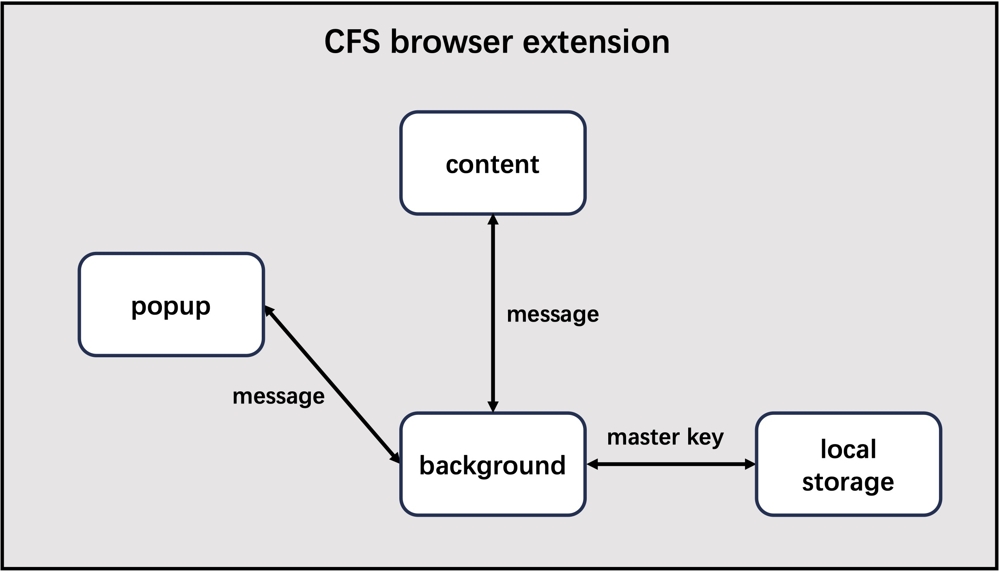

  

加密文件系统浏览器插件的各组件交互流程如上图所示。

在 **popup** 组件中，我们实现了加载加密文件系统配置文件的功能。用户可以通过 `popup.html` 界面上传配置文件和密码，数据以消息形式发送至 **background** 组件。**background** 组件负责验证并计算密钥，验证成功后将加密文件系统的主密钥（master key）存储在浏览器的本地存储中，同时返回成功标志给 **popup** 组件。

在 **content** 组件中，我们使用 XPath 匹配 HTML 元素，提取云存储 Web 端显示的加密文件名，并将其作为消息发送至 **background** 组件。**background** 组件收到消息后进行解密处理，并将解密结果返回给 **content** 组件。随后，**content** 组件将加密文件名替换为解密后的文件名，使用户在云存储页面上能够浏览解密后的文件列表并选择所需文件进行下载。

作为浏览器的服务工作线程，**background** 组件独立运行，具有更高的性能稳定性和系统资源利用效率，因此承担主要的运算任务，具体包括以下三项功能：

1. **配置文件与密码的验证**：**background** 组件接收来自 **popup** 组件的配置文件和密码，验证成功后将主密钥存储在本地，并将验证结果返回至 **popup** 组件。
  
2. **加密文件名的解密**：**background** 组件接收来自 **content** 组件的加密文件名，读取存储在浏览器中的主密钥进行解密，然后将解密结果返回给 **content** 组件。
  
3. **文件解密下载**：当用户点击下载按钮时，**background** 组件会拦截下载请求，获取文件的下载链接并下载文件内容。随后，它从本地存储中读取主密钥对文件进行解密，生成解密后的文件供用户下载。

通过上述设计，用户无需手动解密文件即可在云存储 Web 页面上轻松浏览和下载解密后的文件。